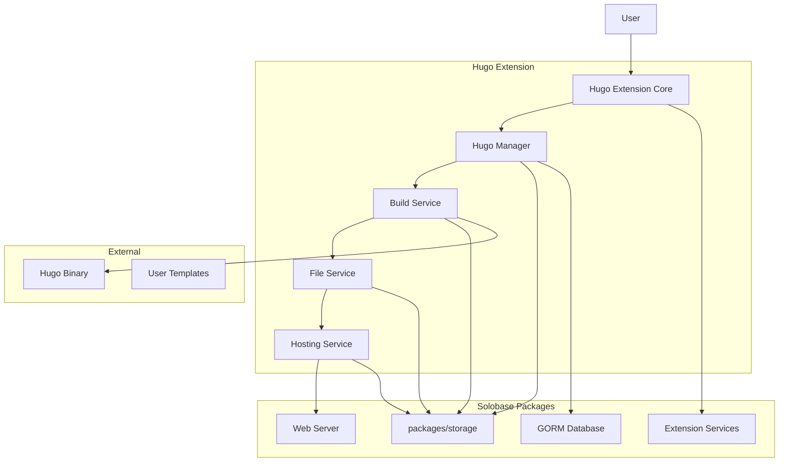

# Design Document

## Overview

The Hugo Static Site Extension integrates Hugo, a fast static site generator, into the solobase platform. This extension allows users to create, manage, build, and host static websites directly within solobase, leveraging the existing storage infrastructure and extension system. The design follows solobase's extension architecture patterns and integrates seamlessly with the packages/storage system for file management and hosting.

## Design Principles

1. **Seamless Integration**: Leverage existing solobase infrastructure (storage, auth, database)
2. **Security First**: Implement proper sandboxing and permission controls
3. **Performance**: Optimize for fast builds and efficient static file serving
4. **Scalability**: Support multiple concurrent sites and builds
5. **User Experience**: Provide intuitive interfaces for both technical and non-technical users
6. **Maintainability**: Follow solobase coding patterns and extension architecture

## Architecture

### High-Level Architecture



### Integration with Existing Packages

The Hugo extension integrates directly with solobase's existing infrastructure:

1. **Database Integration**: Uses the main solobase GORM database instance with auto-migrated models
2. **Storage Integration**: Leverages `packages/storage` for all file operations using `StorageObject` and `StorageBucket` models
3. **Extension System**: Follows the standard solobase extension pattern with proper lifecycle management

### Extension Structure

The Hugo extension follows the standard solobase extension pattern:

- **Extension Core**: Implements the main Extension interface
- **Hugo Manager**: Manages site lifecycle and metadata
- **Build Service**: Handles Hugo build processes
- **File Service**: Manages source and generated files via storage
- **Hosting Service**: Serves static content with proper routing

## Components and Interfaces

### 1. Hugo Extension Core

```go
type HugoExtension struct {
    services     *core.ExtensionServices
    db           *gorm.DB
    storage      *storage.Service
    hugoManager  *HugoManager
    buildService *BuildService
    fileService  *FileService
    hostService  *HostingService
    config       *HugoConfig
}

type HugoConfig struct {
    HugoBinaryPath    string
    MaxSitesPerUser   int
    MaxSiteSize       int64
    BuildTimeout      time.Duration
    AllowedThemes     []string
    DefaultTheme      string
    StorageBucket     string
}
```

### 2. Hugo Manager

```go
type HugoManager struct {
    db      *gorm.DB
    storage *storage.Service
    logger  core.ExtensionLogger
}

// HugoSite represents a Hugo site in the database using GORM
type HugoSite struct {
    ID          string    `gorm:"primaryKey" json:"id"`
    UserID      string    `gorm:"not null;index" json:"user_id"`
    Name        string    `gorm:"not null" json:"name"`
    Description string    `json:"description"`
    Theme       string    `gorm:"not null;default:'default'" json:"theme"`
    Domain      string    `json:"domain"`
    Status      SiteStatus `gorm:"type:varchar(20);not null;default:'active'" json:"status"`
    BuildStatus BuildStatus `gorm:"type:varchar(20);not null;default:'none'" json:"build_status"`
    SourcePath  string    `gorm:"not null" json:"source_path"`
    OutputPath  string    `gorm:"not null" json:"output_path"`
    CreatedAt   time.Time `json:"created_at"`
    UpdatedAt   time.Time `json:"updated_at"`
    LastBuild   *time.Time `json:"last_build,omitempty"`
    BuildLogs   string    `gorm:"type:text" json:"build_logs,omitempty"`
    Config      string    `gorm:"type:text" json:"config,omitempty"` // JSON string
}

// TableName specifies the table name for GORM
func (HugoSite) TableName() string {
    return "ext_hugo_sites"
}

type SiteStatus string
const (
    SiteStatusActive   SiteStatus = "active"
    SiteStatusInactive SiteStatus = "inactive"
    SiteStatusDeleted  SiteStatus = "deleted"
)

type BuildStatus string
const (
    BuildStatusNone    BuildStatus = "none"
    BuildStatusPending BuildStatus = "pending"
    BuildStatusRunning BuildStatus = "running"
    BuildStatusSuccess BuildStatus = "success"
    BuildStatusFailed  BuildStatus = "failed"
)
```

### 3. Build Service

```go
type BuildService struct {
    hugoBinary string
    timeout    time.Duration
    logger     core.ExtensionLogger
    storage    *storage.Service
    db         *gorm.DB
}

type BuildRequest struct {
    SiteID     string
    SourcePath string
    OutputPath string
    Theme      string
    Config     map[string]interface{}
}

type BuildResult struct {
    Success     bool
    Duration    time.Duration
    Logs        string
    Error       string
    OutputFiles []string
}

// HugoBuild represents a build record in the database
type HugoBuild struct {
    ID          string    `gorm:"primaryKey" json:"id"`
    SiteID      string    `gorm:"not null;index" json:"site_id"`
    Status      BuildStatus `gorm:"type:varchar(20);not null" json:"status"`
    StartedAt   time.Time `json:"started_at"`
    CompletedAt *time.Time `json:"completed_at,omitempty"`
    DurationMs  int64     `json:"duration_ms"`
    Logs        string    `gorm:"type:text" json:"logs,omitempty"`
    ErrorMsg    string    `gorm:"type:text" json:"error_message,omitempty"`
    OutputFiles []string  `gorm:"type:text[]" json:"output_files"`
    CreatedAt   time.Time `json:"created_at"`
}

// TableName specifies the table name for GORM
func (HugoBuild) TableName() string {
    return "ext_hugo_builds"
}
```

### 4. File Service

```go
type FileService struct {
    storage *storage.Service
    bucket  string
}

type FileOperation struct {
    Type     FileOpType
    SiteID   string
    Path     string
    Content  []byte
    Metadata map[string]string
}

type FileOpType string
const (
    FileOpCreate FileOpType = "create"
    FileOpUpdate FileOpType = "update"
    FileOpDelete FileOpType = "delete"
    FileOpMove   FileOpType = "move"
)

// Methods will use storage.StorageObject and storage.StorageBucket models
func (fs *FileService) UploadFile(siteID, path string, content []byte) (*storage.StorageObject, error) {
    objectKey := fmt.Sprintf("hugo-sites/%s/source/%s", siteID, path)
    
    storageObj := &storage.StorageObject{
        BucketName:  fs.bucket,
        ObjectKey:   objectKey,
        ObjectType:  storage.ObjectTypeFile,
        Size:        int64(len(content)),
        ContentType: mime.TypeByExtension(filepath.Ext(path)),
        UserID:      "", // Set from context
    }
    
    return fs.storage.Upload(storageObj, content)
}
```

### 5. Hosting Service

```go
type HostingService struct {
    storage *storage.Service
    bucket  string
    db      *gorm.DB
}

type HostingConfig struct {
    SiteID       string
    Domain       string
    CustomDomain string
    IndexFile    string
    ErrorFile    string
    CacheHeaders map[string]string
}

// HugoDomain represents custom domains in the database
type HugoDomain struct {
    ID                string    `gorm:"primaryKey" json:"id"`
    SiteID            string    `gorm:"not null;index" json:"site_id"`
    Domain            string    `gorm:"not null;uniqueIndex" json:"domain"`
    Verified          bool      `gorm:"default:false" json:"verified"`
    VerificationToken string    `json:"verification_token,omitempty"`
    CreatedAt         time.Time `json:"created_at"`
    VerifiedAt        *time.Time `json:"verified_at,omitempty"`
}

// TableName specifies the table name for GORM
func (HugoDomain) TableName() string {
    return "ext_hugo_domains"
}

// Methods will use storage.StorageObject to serve files
func (hs *HostingService) ServeFile(siteID, path string) (*storage.StorageObject, []byte, error) {
    objectKey := fmt.Sprintf("hugo-sites/%s/output/%s", siteID, path)
    return hs.storage.Download(hs.bucket, objectKey)
}
```

## Data Models

### Database Schema

The extension uses GORM models that will be auto-migrated to the main solobase database:

```go
// GORM models that will be auto-migrated
type HugoSite struct {
    ID          string    `gorm:"primaryKey" json:"id"`
    UserID      string    `gorm:"not null;index" json:"user_id"`
    Name        string    `gorm:"not null" json:"name"`
    Description string    `json:"description"`
    Theme       string    `gorm:"not null;default:'default'" json:"theme"`
    Domain      string    `json:"domain"`
    Status      SiteStatus `gorm:"type:varchar(20);not null;default:'active'" json:"status"`
    BuildStatus BuildStatus `gorm:"type:varchar(20);not null;default:'none'" json:"build_status"`
    SourcePath  string    `gorm:"not null" json:"source_path"`
    OutputPath  string    `gorm:"not null" json:"output_path"`
    CreatedAt   time.Time `json:"created_at"`
    UpdatedAt   time.Time `json:"updated_at"`
    LastBuild   *time.Time `json:"last_build,omitempty"`
    BuildLogs   string    `gorm:"type:text" json:"build_logs,omitempty"`
    Config      string    `gorm:"type:text" json:"config,omitempty"`
}

type HugoBuild struct {
    ID          string    `gorm:"primaryKey" json:"id"`
    SiteID      string    `gorm:"not null;index" json:"site_id"`
    Status      BuildStatus `gorm:"type:varchar(20);not null" json:"status"`
    StartedAt   time.Time `json:"started_at"`
    CompletedAt *time.Time `json:"completed_at,omitempty"`
    DurationMs  int64     `json:"duration_ms"`
    Logs        string    `gorm:"type:text" json:"logs,omitempty"`
    ErrorMsg    string    `gorm:"type:text" json:"error_message,omitempty"`
    OutputFiles []string  `gorm:"type:text[]" json:"output_files"`
    CreatedAt   time.Time `json:"created_at"`
}

type HugoTheme struct {
    ID           string    `gorm:"primaryKey" json:"id"`
    Name         string    `gorm:"uniqueIndex;not null" json:"name"`
    DisplayName  string    `gorm:"not null" json:"display_name"`
    Description  string    `json:"description"`
    RepositoryURL string   `json:"repository_url"`
    Version      string    `json:"version"`
    Enabled      bool      `gorm:"default:true" json:"enabled"`
    ConfigSchema string    `gorm:"type:text" json:"config_schema"` // JSON string
    CreatedAt    time.Time `json:"created_at"`
}

// TableName specifies the table name for GORM
func (HugoTheme) TableName() string {
    return "ext_hugo_themes"
}

type HugoDomain struct {
    ID                string    `gorm:"primaryKey" json:"id"`
    SiteID            string    `gorm:"not null;index" json:"site_id"`
    Domain            string    `gorm:"not null;uniqueIndex" json:"domain"`
    Verified          bool      `gorm:"default:false" json:"verified"`
    VerificationToken string    `json:"verification_token,omitempty"`
    CreatedAt         time.Time `json:"created_at"`
    VerifiedAt        *time.Time `json:"verified_at,omitempty"`
}

// Auto-migration will be handled in the Initialize method:
func (e *HugoExtension) Initialize(ctx context.Context, services *core.ExtensionServices) error {
    // Auto-migrate GORM models
    err := e.db.AutoMigrate(
        &HugoSite{},
        &HugoBuild{},
        &HugoTheme{},
        &HugoDomain{},
    )
    if err != nil {
        return fmt.Errorf("failed to migrate Hugo tables: %w", err)
    }
    
    return nil
}
```

### Storage Structure

Files are organized using the packages/storage system with StorageObject and StorageBucket models:

```
Bucket: "hugo-sites"
├── {site-id}/
│   ├── source/
│   │   ├── config.toml          (StorageObject)
│   │   ├── content/             (StorageObject - folder)
│   │   │   ├── _index.md        (StorageObject)
│   │   │   └── posts/           (StorageObject - folder)
│   │   ├── layouts/             (StorageObject - folder)
│   │   ├── static/              (StorageObject - folder)
│   │   └── themes/              (StorageObject - folder)
│   ├── output/
│   │   ├── index.html           (StorageObject)
│   │   ├── css/                 (StorageObject - folder)
│   │   ├── js/                  (StorageObject - folder)
│   │   └── images/              (StorageObject - folder)
│   └── backups/
│       └── {timestamp}/         (StorageObject - folder)
└── themes/
    ├── default/                 (StorageObject - folder)
    ├── blog/                    (StorageObject - folder)
    └── portfolio/               (StorageObject - folder)

// Each file/folder is represented as a StorageObject:
type StorageObject struct {
    ID             string     `gorm:"primaryKey" json:"id"`
    BucketName     string     `gorm:"not null;index" json:"bucket_name"`
    ObjectKey      string     `gorm:"not null;index" json:"object_key"`
    ObjectType     ObjectType `gorm:"type:varchar(10);not null;default:'file'" json:"object_type"`
    ParentFolderID *string    `gorm:"index" json:"parent_folder_id,omitempty"`
    Size           int64      `json:"size"`
    ContentType    string     `json:"content_type"`
    Checksum       string     `gorm:"index" json:"checksum,omitempty"`
    Metadata       string     `gorm:"type:text" json:"metadata,omitempty"`
    CreatedAt      time.Time  `json:"created_at"`
    UpdatedAt      time.Time  `json:"updated_at"`
    UserID         string     `gorm:"index" json:"user_id,omitempty"`
}
```

## Error Handling

### Error Types

```go
type HugoError struct {
    Type    HugoErrorType
    SiteID  string
    Message string
    Details map[string]interface{}
}

type HugoErrorType string
const (
    ErrorSiteNotFound     HugoErrorType = "site_not_found"
    ErrorBuildFailed      HugoErrorType = "build_failed"
    ErrorStorageError     HugoErrorType = "storage_error"
    ErrorInvalidConfig    HugoErrorType = "invalid_config"
    ErrorThemeNotFound    HugoErrorType = "theme_not_found"
    ErrorDomainTaken      HugoErrorType = "domain_taken"
    ErrorQuotaExceeded    HugoErrorType = "quota_exceeded"
    ErrorHugoBinaryError  HugoErrorType = "hugo_binary_error"
)
```

### Error Recovery

- **Build Failures**: Preserve previous successful build, display detailed error logs
- **Storage Errors**: Implement retry logic with exponential backoff
- **Hugo Binary Errors**: Validate Hugo installation on extension startup
- **Theme Errors**: Fall back to default theme if custom theme fails
- **Domain Conflicts**: Provide alternative domain suggestions

## Testing Strategy

### Unit Tests

1. **Hugo Manager Tests**
   - Site creation, update, deletion
   - Metadata management
   - Status transitions

2. **Build Service Tests**
   - Hugo build process execution
   - Error handling and logging
   - Timeout handling

3. **File Service Tests**
   - File upload/download operations
   - Directory structure management
   - Storage integration

4. **Hosting Service Tests**
   - Static file serving
   - Custom domain routing
   - Cache header management

### Integration Tests

1. **End-to-End Site Creation**
   - Create site → Upload files → Build → Host
   - Verify complete workflow

2. **Storage Integration**
   - Test with actual storage backend
   - File persistence and retrieval

3. **Hugo Binary Integration**
   - Test with real Hugo builds
   - Theme application and customization

### Performance Tests

1. **Build Performance**
   - Large site build times
   - Concurrent build handling
   - Resource usage monitoring

2. **Hosting Performance**
   - Static file serving speed
   - Concurrent request handling
   - Cache effectiveness

### Security Tests

1. **File Upload Security**
   - Malicious file detection
   - Path traversal prevention
   - File size limits

2. **Domain Security**
   - Domain verification
   - Subdomain takeover prevention
   - SSL/TLS configuration

## API Endpoints

### Site Management

- `GET /ext/hugo/api/sites` - List user's sites
- `POST /ext/hugo/api/sites` - Create new site
- `GET /ext/hugo/api/sites/{id}` - Get site details
- `PUT /ext/hugo/api/sites/{id}` - Update site
- `DELETE /ext/hugo/api/sites/{id}` - Delete site

### File Management

- `GET /ext/hugo/api/sites/{id}/files` - List site files
- `POST /ext/hugo/api/sites/{id}/files` - Upload files
- `GET /ext/hugo/api/sites/{id}/files/{path}` - Get file content
- `PUT /ext/hugo/api/sites/{id}/files/{path}` - Update file
- `DELETE /ext/hugo/api/sites/{id}/files/{path}` - Delete file

### Build Management

- `POST /ext/hugo/api/sites/{id}/build` - Trigger build
- `GET /ext/hugo/api/sites/{id}/builds` - List build history
- `GET /ext/hugo/api/sites/{id}/builds/{buildId}` - Get build details
- `GET /ext/hugo/api/sites/{id}/builds/{buildId}/logs` - Get build logs

### Hosting

- `GET /ext/hugo/api/sites/{id}/preview` - Get preview URL
- `POST /ext/hugo/api/sites/{id}/domains` - Add custom domain
- `DELETE /ext/hugo/api/sites/{id}/domains/{domain}` - Remove domain

### Themes

- `GET /ext/hugo/api/themes` - List available themes
- `GET /ext/hugo/api/themes/{name}` - Get theme details

## Dashboard Interface

The extension provides a comprehensive dashboard with:

1. **Site Overview**
   - Site list with status indicators
   - Quick actions (build, preview, settings)
   - Usage statistics

2. **Site Editor**
   - File browser and editor
   - Live preview
   - Build status and logs

3. **Theme Gallery**
   - Available themes showcase
   - Theme preview and selection
   - Custom theme upload

4. **Domain Management**
   - Custom domain configuration
   - DNS verification status
   - SSL certificate management

5. **Analytics**
   - Site traffic statistics
   - Build performance metrics
   - Storage usage tracking

## Security Considerations

1. **Access Control**
   - Restrict site creation to administrators only
   - Implement role-based permissions for all management operations
   - Allow read-only access for non-admin users

2. **File Security**
   - Validate uploaded file types
   - Scan for malicious content
   - Implement file size limits

3. **Build Security**
   - Sandbox Hugo build process
   - Limit build resources
   - Prevent code execution in content

4. **Hosting Security**
   - Serve only static content
   - Implement proper CORS headers
   - Prevent directory traversal

5. **Domain Security**
   - Verify domain ownership
   - Prevent subdomain takeover
   - Implement rate limiting

## Permissions Model

The extension implements a two-tier permission system:

```go
// Required permissions for the Hugo extension
var RequiredPermissions = []core.Permission{
    {
        Name:        "hugo.admin",
        Description: "Full Hugo site administration (admin only)",
        Resource:    "hugo",
        Actions:     []string{"create", "update", "delete", "build", "manage"},
    },
    {
        Name:        "hugo.view",
        Description: "View Hugo sites and content",
        Resource:    "hugo",
        Actions:     []string{"read", "view"},
    },
}
```

- **hugo.admin**: Required for all site management operations (admin users only)
- **hugo.view**: Allows viewing sites and accessing hosted content (all users)

## Performance Optimizations

1. **Build Optimization**
   - Incremental builds when possible
   - Build queue management with priority system
   - Resource pooling for concurrent builds
   - Build caching for unchanged content

2. **Storage Optimization**
   - File compression for source and output files
   - Deduplication of common assets
   - Efficient file organization with proper indexing
   - Lazy loading of large file lists

3. **Hosting Optimization**
   - Static file caching with ETags
   - Gzip/Brotli compression
   - HTTP/2 support with server push
   - Edge caching for frequently accessed files

4. **Database Optimization**
   - Proper indexing on frequently queried fields
   - Query optimization with eager loading
   - Connection pooling via GORM
   - Periodic cleanup of old build logs

## Monitoring and Observability

1. **Metrics Collection**
   - Build duration and success rates
   - Storage usage per site
   - Request latency for hosted sites
   - Error rates and types

2. **Logging**
   - Structured logging for all operations
   - Build process detailed logging
   - Access logs for hosted sites
   - Error tracking with context

3. **Alerting**
   - Build failure notifications
   - Storage quota warnings
   - Performance degradation alerts
   - Security incident notifications

## Migration Strategy

For existing solobase installations:

1. **Extension Installation**
   - Auto-migration of database tables
   - Creation of storage buckets
   - Hugo binary installation verification

2. **Data Migration**
   - Import existing static sites if applicable
   - Convert legacy hosting configurations
   - Migrate custom domain settings

3. **Rollback Plan**
   - Backup all data before migration
   - Provide rollback scripts
   - Maintain backward compatibility