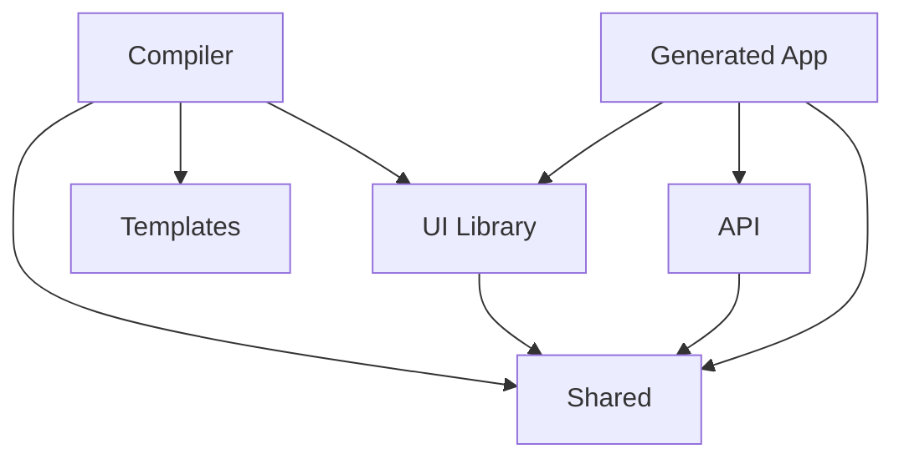

# Design Document

## Overview

The JSON App Compiler is a Deno Fresh monorepo system that transforms JSON configuration files into fully functional web applications. The system follows a modular architecture with five core packages that work together to provide a complete application generation pipeline.

The architecture leverages Deno native package management, improved performance, and Fresh 2.0 alpha's enhanced island architecture and new features to create scalable, maintainable applications.

## Architecture

### Monorepo Structure

```
/
├── packages/
│   ├── compiler/           # Core compilation engine
│   ├── api/               # Backend API functionality
│   ├── ui-library/        # Reusable UI components
│   ├── shared/            # Common types and utilities
│   └── templates/         # Application templates
├── examples/              # Example JSON configurations
├── docs/                  # Documentation
├── deno.json             # Workspace configuration
└── README.md
```

### Package Dependencies



## Components and Interfaces

### 1. Shared Package (`packages/shared/`)

**Purpose:** Provides common types, utilities, and validation schemas used across all packages.

**Key Modules:**
- `types.ts` - Core TypeScript interfaces and types
- `schemas.ts` - JSON schema definitions for validation
- `utils.ts` - Common utility functions
- `validators.ts` - Input validation functions

**Core Types:**
```typescript
interface AppConfig {
  metadata: AppMetadata;
  components: ComponentDefinition[];
  routes: RouteDefinition[];
  api: ApiDefinition;
  theme?: ThemeConfig;
}

interface ComponentDefinition {
  id: string;
  type: string;
  props: Record<string, unknown>;
  children?: ComponentDefinition[];
}

interface RouteDefinition {
  path: string;
  component: string;
  layout?: string;
  middleware?: string[];
}
```

### 2. UI Library Package (`packages/ui-library/`)

**Purpose:** Provides a catalog of reusable Fresh island components that can be assembled by the compiler.

**Key Modules:**
- `components/` - Individual component implementations
- `index.ts` - Component registry and exports
- `types.ts` - Component-specific type definitions
- `styles/` - Component styling (CSS modules or Tailwind)

**Component Architecture:**
- Each component is a Fresh island with TypeScript
- Components accept standardized props interface
- Components include built-in validation and error boundaries
- Components support theming through CSS custom properties

**Example Component Structure:**
```typescript
// components/Button/Button.tsx
interface ButtonProps {
  variant: 'primary' | 'secondary' | 'danger';
  size: 'sm' | 'md' | 'lg';
  onClick?: () => void;
  children: ComponentChildren;
}

export default function Button(props: ButtonProps) {
  // Component implementation
}
```

### 3. API Package (`packages/api/`)

**Purpose:** Provides backend functionality and route handlers for generated applications.

**Key Modules:**
- `handlers/` - HTTP request handlers
- `middleware/` - Common middleware functions
- `services/` - Business logic services
- `types.ts` - API-specific types

**Handler Architecture:**
- RESTful API patterns with Fresh route handlers
- Automatic CRUD generation based on JSON config
- Built-in validation using shared schemas
- Consistent error handling and response formatting

### 4. Templates Package (`packages/templates/`)

**Purpose:** Contains base application templates that the compiler copies and customizes.

**Structure:**
```
templates/
├── base/                  # Basic Fresh app template
│   ├── routes/
│   ├── islands/
│   ├── static/
│   ├── deno.json
│   └── main.ts
├── components/            # Template component files
└── configs/              # Configuration file templates
```

**Template Features:**
- Placeholder replacement system using `{{variable}}` syntax
- Conditional file inclusion based on JSON config
- Fresh 2.0 alpha framework best practices built-in
- Deno optimizations and native package management

### 5. Compiler Package (`packages/compiler/`)

**Purpose:** Core compilation engine that orchestrates the application generation process.

**Key Modules:**
- `parser.ts` - JSON configuration parsing and validation
- `generator.ts` - Application generation orchestration
- `file-manager.ts` - File system operations
- `template-engine.ts` - Template processing and placeholder replacement
- `component-resolver.ts` - UI component resolution and integration

**Compilation Pipeline:**
1. **Parse Phase:** Validate and parse JSON configuration
2. **Plan Phase:** Create generation plan and dependency graph
3. **Generate Phase:** Copy templates and generate files
4. **Integrate Phase:** Wire components and API routes
5. **Optimize Phase:** Apply Deno optimizations

## Data Models

### JSON Configuration Schema

The compiler accepts JSON files following this schema structure:

```json
{
  "metadata": {
    "name": "my-app",
    "version": "1.0.0",
    "description": "Generated application"
  },
  "components": [
    {
      "id": "header",
      "type": "Header",
      "props": {
        "title": "My App",
        "navigation": [...]
      }
    }
  ],
  "routes": [
    {
      "path": "/",
      "component": "HomePage",
      "layout": "MainLayout"
    }
  ],
  "api": {
    "endpoints": [
      {
        "path": "/api/users",
        "methods": ["GET", "POST"],
        "handler": "UserHandler"
      }
    ]
  }
}
```

### Component Registry

The UI library maintains a registry of available components:

```typescript
interface ComponentRegistry {
  [componentType: string]: {
    component: ComponentType;
    schema: JSONSchema;
    dependencies: string[];
  };
}
```

## Error Handling

### Validation Errors
- JSON schema validation with detailed error messages
- Component prop validation with type checking
- Route configuration validation
- Dependency resolution error reporting

### Runtime Errors
- Graceful degradation for missing components
- Error boundaries in generated applications
- Detailed logging for debugging
- Recovery mechanisms for partial failures

### Build Errors
- Template processing error handling
- File system operation error recovery
- Dependency resolution failure handling
- Clear error messages with suggested fixes

## Testing Strategy

### Unit Testing
- Individual package testing with Deno's built-in test runner
- Component testing with Fresh testing utilities
- JSON schema validation testing
- Template processing testing

### Integration Testing
- End-to-end compilation pipeline testing
- Generated application functionality testing
- Cross-package integration testing
- Performance benchmarking

### Example-Based Testing
- Test suite using example JSON configurations
- Regression testing with known-good outputs
- Edge case testing with complex configurations
- Validation testing with invalid inputs

### Testing Tools
- Deno's native test runner (`deno test`)
- Fresh testing utilities for component testing
- JSON schema testing libraries
- Custom test utilities for compilation testing

## Performance Considerations

### Deno Optimizations
- Leverage improved module resolution and faster startup times
- Utilize enhanced TypeScript compilation speed
- Take advantage of better HTTP/2 support and networking improvements
- Use native package management with JSR and npm compatibility

### Fresh 2.0 Alpha Features
- Enhanced island architecture with improved hydration
- Better server-side rendering performance
- Improved build-time optimizations
- Advanced routing capabilities and middleware support

### Compilation Performance
- Incremental compilation for large projects
- Parallel processing where possible
- Caching of compiled templates and components
- Efficient file system operations with Deno's native APIs

### Generated Application Performance
- Tree-shaking of unused components leveraging Fresh 2.0 optimizations
- Optimized island hydration with Fresh 2.0 improvements
- Efficient CSS bundling and minification
- Static asset optimization and caching strategies