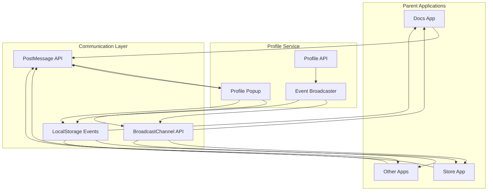

# Design Document

## Overview

This design implements a real-time profile synchronization system that enables immediate propagation of profile changes (theme, display name, avatar, etc.) across all connected applications in the Suppers platform. The system replaces the current tab-based profile viewing with a popup-based interface and introduces a cross-application event broadcasting mechanism.

The solution addresses the current UX issue where users must sign out and sign back in to see profile changes reflected in parent applications. It provides a seamless, real-time experience where changes are immediately visible across all open application instances.

## Architecture

### High-Level Architecture



### Communication Patterns

1. **Popup-to-Parent Communication**: Uses `postMessage` API for direct communication between profile popup and the parent window that opened it
2. **Cross-Tab Communication**: Uses `BroadcastChannel` API for real-time communication between multiple tabs/windows of the same origin
3. **Storage-Based Fallback**: Uses `localStorage` events as a fallback for browsers that don't support BroadcastChannel
4. **Mobile Adaptation**: Detects mobile devices and uses modal overlays instead of popups

## Components and Interfaces

### 1. Profile Sync Manager

**Location**: `packages/shared/utils/profile-sync.ts`

```typescript
interface ProfileSyncManager {
  // Event broadcasting
  broadcastProfileChange(change: ProfileChangeEvent): void;
  subscribeToProfileChanges(callback: ProfileChangeCallback): () => void;
  
  // Popup management
  openProfilePopup(options: ProfilePopupOptions): ProfilePopupHandle;
  closeProfilePopup(handle: ProfilePopupHandle): void;
  
  // Mobile detection and adaptation
  isMobileDevice(): boolean;
  shouldUseModal(): boolean;
}

interface ProfileChangeEvent {
  type: 'theme' | 'avatar' | 'displayName' | 'profile' | 'signOut';
  data: any;
  timestamp: number;
  source: string; // application that initiated the change
}

interface ProfilePopupOptions {
  origin: string;
  appName: string;
  dimensions?: { width: number; height: number };
  position?: 'center' | 'right' | 'left';
}
```

### 2. Enhanced Profile Card Component

**Location**: `packages/ui-lib/components/page/profile-card/ProfileCard.tsx`

The existing ProfileCard component will be enhanced with:

```typescript
interface EnhancedProfileCardProps extends ProfileCardProps {
  // Real-time sync options
  enableRealTimeSync?: boolean;
  syncSource?: string; // identifier for the source application
  
  // Popup-specific options
  isPopupMode?: boolean;
  parentOrigin?: string;
  onPopupClose?: () => void;
  
  // Event callbacks
  onProfileChange?: (change: ProfileChangeEvent) => void;
}
```

### 3. Cross-Application Auth Helpers

**Location**: `packages/shared/utils/cross-app-auth.ts`

```typescript
interface CrossAppAuthHelpers {
  // Unified session management
  syncSessionAcrossApps(session: Session): void;
  clearSessionAcrossApps(): void;
  
  // Theme synchronization
  syncThemeAcrossApps(theme: string): void;
  
  // User data synchronization
  syncUserDataAcrossApps(userData: Partial<User>): void;
  
  // Event handling
  handleProfileChangeEvent(event: ProfileChangeEvent): void;
}
```

### 4. Mobile-Responsive Profile Modal

**Location**: `packages/ui-lib/components/page/profile-modal/ProfileModal.tsx`

```typescript
interface ProfileModalProps {
  isOpen: boolean;
  onClose: () => void;
  user: User;
  isMobile: boolean;
  // ... other ProfileCard props
}
```

## Data Models

### Profile Change Event Schema

```typescript
interface ProfileChangeEvent {
  type: 'theme' | 'avatar' | 'displayName' | 'profile' | 'signOut';
  data: {
    // For theme changes
    theme?: string;
    
    // For avatar changes
    avatarUrl?: string;
    
    // For display name changes
    displayName?: string;
    firstName?: string;
    lastName?: string;
    
    // For full profile updates
    user?: Partial<User>;
    
    // For sign out events
    reason?: string;
  };
  timestamp: number;
  source: string;
  userId: string;
}
```

### Popup Configuration Schema

```typescript
interface PopupConfig {
  dimensions: {
    width: number;
    height: number;
    minWidth: number;
    minHeight: number;
  };
  position: {
    centered: boolean;
    offsetX?: number;
    offsetY?: number;
  };
  features: {
    scrollbars: boolean;
    resizable: boolean;
    menubar: boolean;
    toolbar: boolean;
    location: boolean;
    status: boolean;
  };
  mobile: {
    useModal: boolean;
    fullScreen: boolean;
  };
}
```

## Error Handling

### 1. Popup Blocking

```typescript
interface PopupFallbackStrategy {
  // Detection
  detectPopupBlocked(popup: Window | null): boolean;
  
  // Fallback options
  showPopupBlockedNotification(): void;
  openInNewTab(): void;
  showInlineModal(): void;
}
```

### 2. Communication Failures

```typescript
interface CommunicationErrorHandler {
  // Retry mechanisms
  retryBroadcast(event: ProfileChangeEvent, maxRetries: number): Promise<void>;
  
  // Fallback strategies
  fallbackToLocalStorage(event: ProfileChangeEvent): void;
  fallbackToPolling(): void;
  
  // Error reporting
  reportCommunicationError(error: Error, context: string): void;
}
```

### 3. Network Connectivity

```typescript
interface ConnectivityHandler {
  // Detection
  isOnline(): boolean;
  onConnectivityChange(callback: (online: boolean) => void): () => void;
  
  // Queue management
  queueProfileChange(change: ProfileChangeEvent): void;
  flushQueuedChanges(): Promise<void>;
  
  // Sync recovery
  syncOnReconnect(): Promise<void>;
}
```

## Testing Strategy

### 1. Unit Tests

- **Profile Sync Manager**: Test event broadcasting, subscription management, popup handling
- **Cross-App Auth Helpers**: Test session synchronization, theme updates, user data sync
- **Communication Layer**: Test postMessage, BroadcastChannel, localStorage fallbacks
- **Mobile Detection**: Test device detection and modal fallback logic

### 2. Integration Tests

- **Multi-Tab Scenarios**: Test profile changes propagating across multiple tabs
- **Popup Communication**: Test parent-popup communication flows
- **Error Scenarios**: Test popup blocking, network failures, communication errors
- **Mobile Adaptation**: Test modal behavior on mobile devices

### 3. End-to-End Tests

- **Complete User Flows**: Test full profile change workflows from different applications
- **Cross-Browser Testing**: Test compatibility across different browsers
- **Mobile Testing**: Test mobile-specific behaviors and responsive design
- **Performance Testing**: Test real-time sync performance with multiple open tabs

### 4. Visual Testing

- **Popup Positioning**: Test popup centering and positioning across different screen sizes
- **Modal Responsiveness**: Test mobile modal behavior and responsive design
- **Theme Transitions**: Test smooth theme transitions across applications
- **Loading States**: Test loading and error states in popup and modal interfaces

## Implementation Phases

### Phase 1: Core Infrastructure
- Implement ProfileSyncManager with basic event broadcasting
- Create cross-application communication utilities
- Add mobile detection and popup/modal decision logic
- Implement basic popup management

### Phase 2: Profile Integration
- Enhance ProfileCard component with real-time sync capabilities
- Implement ProfileModal component for mobile devices
- Add profile change event handling to existing auth helpers
- Create unified session management across applications

### Phase 3: Application Integration
- Update docs, store, and other applications to use new profile system
- Replace existing "View Profile" links with popup-based interface
- Implement real-time theme synchronization
- Add comprehensive error handling and fallback strategies

### Phase 4: Testing and Polish
- Implement comprehensive test suite
- Add performance optimizations
- Implement advanced features (queuing, retry logic, etc.)
- Add monitoring and analytics for sync performance

## Security Considerations

### 1. Origin Validation

```typescript
interface OriginValidator {
  validateOrigin(origin: string): boolean;
  getAllowedOrigins(): string[];
  isLocalDevelopment(): boolean;
}
```

### 2. Message Validation

```typescript
interface MessageValidator {
  validateProfileChangeEvent(event: any): ProfileChangeEvent | null;
  sanitizeEventData(data: any): any;
  validateEventSource(source: string): boolean;
}
```

### 3. Session Security

- Ensure tokens are not exposed in cross-application messages
- Validate user permissions before applying profile changes
- Implement rate limiting for profile change events
- Add audit logging for profile synchronization events

## Performance Considerations

### 1. Event Throttling

```typescript
interface EventThrottler {
  throttleProfileChanges(events: ProfileChangeEvent[], windowMs: number): ProfileChangeEvent[];
  debounceThemeChanges(callback: () => void, delayMs: number): () => void;
}
```

### 2. Memory Management

- Clean up event listeners when components unmount
- Limit the number of queued profile change events
- Implement garbage collection for old event data
- Monitor memory usage in long-running applications

### 3. Network Optimization

- Batch multiple profile changes when possible
- Implement intelligent retry strategies with exponential backoff
- Use efficient serialization for cross-application messages
- Cache profile data to reduce API calls

## Browser Compatibility

### Supported Features by Browser

| Feature | Chrome | Firefox | Safari | Edge | Mobile |
|---------|--------|---------|--------|------|--------|
| BroadcastChannel | ✅ | ✅ | ✅ | ✅ | ✅ |
| PostMessage | ✅ | ✅ | ✅ | ✅ | ✅ |
| LocalStorage Events | ✅ | ✅ | ✅ | ✅ | ✅ |
| Popup Windows | ✅ | ✅ | ✅ | ✅ | ⚠️ |

### Fallback Strategies

1. **BroadcastChannel not supported**: Fall back to localStorage events
2. **Popup blocked**: Show notification and offer new tab option
3. **Mobile device**: Use modal overlay instead of popup
4. **JavaScript disabled**: Graceful degradation to traditional tab-based profile