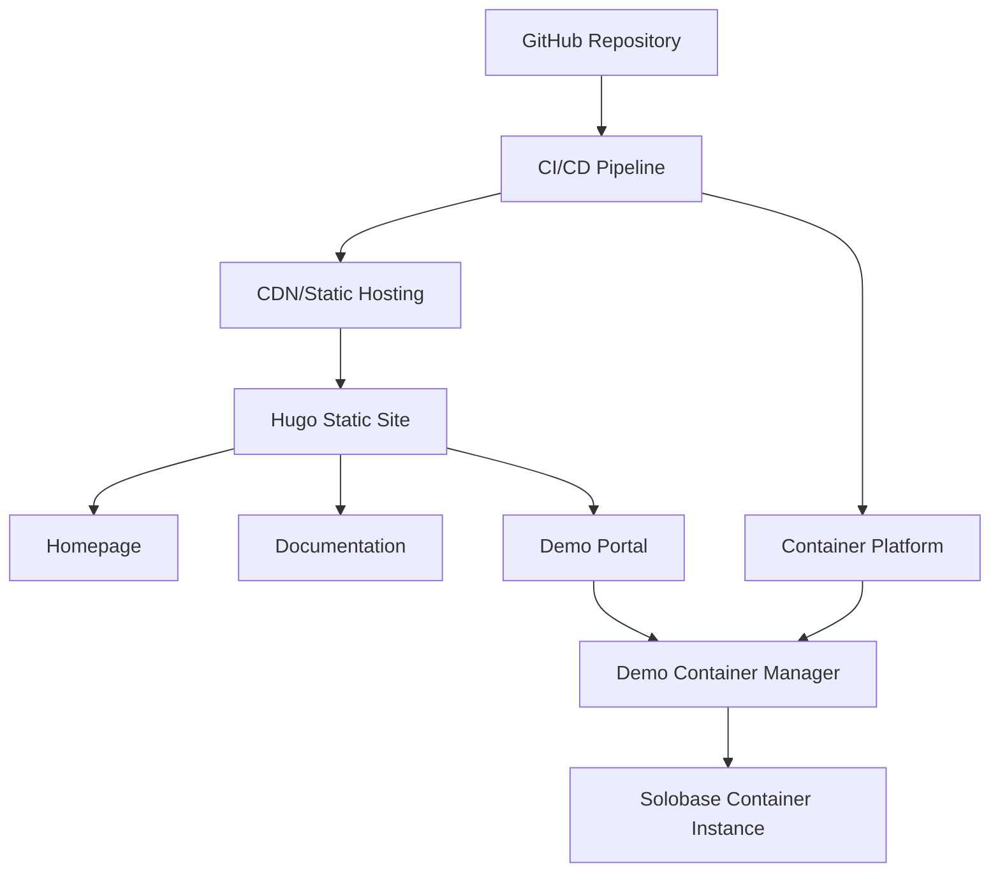

# Design Document

## Overview

The Solobase Demo Site will be a Hugo-based static website that serves as a marketing and demonstration platform for the Go Solobase project. The site will consist of three main sections: a marketing homepage, a live demo environment, and comprehensive documentation. The architecture will leverage Hugo's static site generation capabilities for fast loading and easy deployment, while providing a secure containerized demo environment.

## Architecture

### High-Level Architecture



### Deployment Architecture

The system will use a two-tier deployment approach:

1. **Static Site Tier**: Hugo-generated static files hosted on a CDN or static hosting platform
2. **Demo Tier**: Containerized Solobase instances managed by a container orchestration platform

## Components and Interfaces

### 1. Hugo Static Site Generator

**Purpose**: Generate the marketing website and documentation
**Technology**: Hugo with a modern theme
**Structure**:
```
solobase-demo-site/
├── content/
│   ├── _index.md              # Homepage content
│   ├── docs/                  # Documentation section
│   │   ├── _index.md
│   │   ├── installation.md
│   │   ├── configuration.md
│   │   ├── api-reference.md
│   │   └── examples.md
│   └── demo/
│       └── _index.md          # Demo portal page
├── layouts/
│   ├── _default/
│   ├── partials/
│   └── shortcodes/
├── static/
│   ├── css/
│   ├── js/
│   └── images/
├── themes/
└── config.yaml
```

### 2. Homepage Component

**Features**:
- Hero section with Solobase branding and value proposition
- Feature highlights with icons and descriptions
- Call-to-action buttons for demo and documentation
- Responsive design with modern CSS framework (Tailwind CSS)
- Performance optimized with lazy loading and compressed assets

**Content Sections**:
- Hero: "Solobase - Modern Admin Dashboard in a Single Binary"
- Features: Authentication, Database Management, Storage, Collections
- Use Cases: Rapid prototyping, Internal tools, Admin panels
- Getting Started: Quick installation guide
- Demo CTA: Prominent button to access live demo

### 3. Documentation System

**Structure**: Hierarchical documentation using Hugo's content organization
**Features**:
- Search functionality using Lunr.js or similar
- Code syntax highlighting
- Copy-to-clipboard for code blocks
- Navigation sidebar with section organization
- Version compatibility information
- API documentation with interactive examples

**Content Organization**:
- Getting Started: Installation, quick start, basic configuration
- User Guide: Dashboard features, user management, database operations
- API Reference: Endpoint documentation with examples
- Deployment: Docker, cloud platforms, environment variables
- Development: Contributing, building from source, architecture

### 4. Demo Portal

**Purpose**: Provide access to live Solobase instances
**Features**:
- Demo instance launcher with loading states
- Usage instructions and guided tour
- Session management and cleanup
- Error handling and fallback messaging
- Security warnings and limitations

### 5. Container Management System

**Technology**: Docker with orchestration (Docker Compose or Kubernetes)
**Features**:
- On-demand container provisioning
- Automatic cleanup after session timeout
- Resource limits and security constraints
- Health monitoring and restart capabilities
- Load balancing for multiple concurrent users

**Container Configuration**:
```yaml
# docker-compose.demo.yml
version: '3.8'
services:
  solobase-demo:
    image: solobase:latest
    environment:
      - DATABASE_TYPE=sqlite
      - DATABASE_URL=file:./demo.db
      - DEFAULT_ADMIN_EMAIL=demo@solobase.dev
      - DEFAULT_ADMIN_PASSWORD=demo123
    volumes:
      - demo-data:/app/data
    networks:
      - demo-network
    restart: unless-stopped
    deploy:
      resources:
        limits:
          memory: 512M
          cpus: '0.5'
```

## Data Models

### Site Configuration

```yaml
# config.yaml
baseURL: 'https://solobase.dev'
languageCode: 'en-us'
title: 'Solobase - Modern Admin Dashboard'
theme: 'solobase-theme'

params:
  description: 'A modern, full-featured admin dashboard built with Svelte and Go'
  author: 'Solobase Team'
  logo: '/images/solobase-logo.svg'
  demo_url: 'https://demo.solobase.dev'
  github_url: 'https://github.com/user/solobase'
  
menu:
  main:
    - name: 'Home'
      url: '/'
      weight: 10
    - name: 'Documentation'
      url: '/docs/'
      weight: 20
    - name: 'Live Demo'
      url: '/demo/'
      weight: 30
    - name: 'GitHub'
      url: 'https://github.com/user/solobase'
      weight: 40

markup:
  goldmark:
    renderer:
      unsafe: true
  highlight:
    style: github
    lineNos: true
```

### Demo Session Model

```typescript
interface DemoSession {
  id: string;
  containerName: string;
  createdAt: Date;
  expiresAt: Date;
  status: 'starting' | 'ready' | 'error' | 'expired';
  accessUrl: string;
  userAgent: string;
  ipAddress: string;
}
```

## Error Handling

### Static Site Errors

- **404 Pages**: Custom 404 page with navigation back to main sections
- **Build Errors**: CI/CD pipeline validation and rollback mechanisms
- **Asset Loading**: Fallback fonts and graceful degradation for missing assets

### Demo Environment Errors

- **Container Startup Failures**: Retry logic with exponential backoff
- **Resource Exhaustion**: Queue system with user notification
- **Network Issues**: Health checks and automatic container restart
- **Security Violations**: Immediate container termination and IP logging

### Error Response Format

```json
{
  "error": {
    "code": "DEMO_UNAVAILABLE",
    "message": "Demo environment is temporarily unavailable",
    "details": "All demo instances are currently in use. Please try again in a few minutes.",
    "retryAfter": 300
  }
}
```

## Testing Strategy

### Static Site Testing

1. **Build Testing**: Automated Hugo build validation in CI/CD
2. **Link Checking**: Automated link validation for internal and external links
3. **Performance Testing**: Lighthouse CI for performance, accessibility, and SEO
4. **Cross-browser Testing**: Automated testing across major browsers
5. **Mobile Responsiveness**: Automated responsive design testing

### Demo Environment Testing

1. **Container Health Checks**: Automated health monitoring for demo instances
2. **Load Testing**: Simulate multiple concurrent demo sessions
3. **Security Testing**: Penetration testing for container isolation
4. **Recovery Testing**: Validate automatic cleanup and restart mechanisms
5. **Integration Testing**: End-to-end testing of demo provisioning flow

### Content Testing

1. **Documentation Accuracy**: Automated testing of code examples
2. **Content Freshness**: Validation that documentation matches current Solobase version
3. **Search Functionality**: Testing of documentation search features
4. **Accessibility**: WCAG compliance testing for all content

### Monitoring and Analytics

1. **Site Analytics**: Google Analytics or privacy-focused alternative
2. **Demo Usage Metrics**: Track demo session duration and user interactions
3. **Performance Monitoring**: Real-time monitoring of site performance
4. **Error Tracking**: Automated error reporting and alerting
5. **Uptime Monitoring**: Continuous monitoring of site and demo availability

## Security Considerations

### Demo Environment Security

- **Container Isolation**: Strict resource limits and network isolation
- **Data Persistence**: No persistent data storage in demo containers
- **Session Timeouts**: Automatic cleanup after 30 minutes of inactivity
- **Rate Limiting**: Prevent abuse with IP-based rate limiting
- **Security Headers**: Implement CSP, HSTS, and other security headers

### Static Site Security

- **HTTPS Enforcement**: Force HTTPS for all traffic
- **Content Security Policy**: Strict CSP to prevent XSS attacks
- **Dependency Scanning**: Regular security scanning of Hugo and theme dependencies
- **Access Logs**: Monitor for suspicious activity patterns