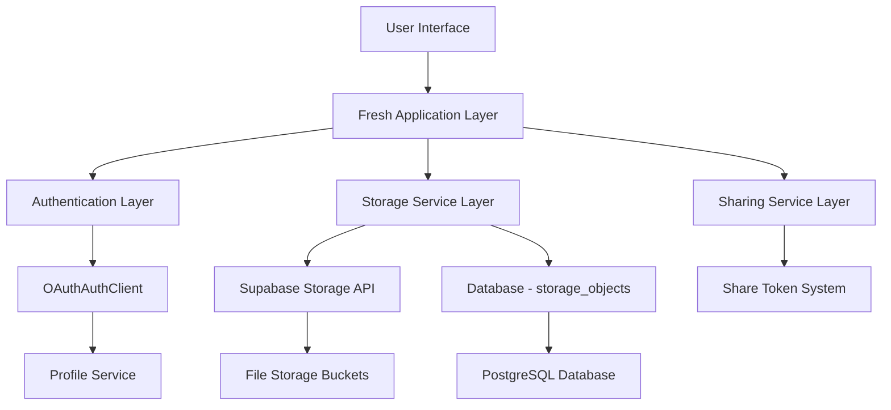

# Design Document

## Overview

Sorted Storage is a minimalist cloud storage application built on the Suppers AI platform. The application provides users with an intuitive file and folder management system featuring flexible layout options and customization capabilities. The design emphasizes simplicity while maintaining extensibility for future enhancements.

The application leverages the existing Supabase storage infrastructure and follows established patterns from the recorder and paint applications for sharing functionality. It integrates seamlessly with the platform's authentication system and UI component library.

## Architecture

### High-Level Architecture



### Application Structure

The application follows the standard Fresh application structure:

```
applications/sorted-storage/
├── main.ts                 # Application entry point
├── dev.ts                  # Development server
├── deno.json              # Dependencies and configuration
├── routes/                # File-based routing
│   ├── index.tsx          # Main storage dashboard
│   ├── folder/[id].tsx    # Folder view
│   └── share/[token].tsx  # Shared content view
├── islands/               # Client-side interactive components
│   ├── StorageDashboardIsland.tsx
│   ├── FileUploadIsland.tsx
│   ├── FolderManagerIsland.tsx
│   └── ShareManagerIsland.tsx
├── components/            # Server-side components
│   ├── Layout.tsx
│   ├── FileItem.tsx
│   ├── FolderItem.tsx
│   └── LayoutSwitcher.tsx
├── lib/                   # Utilities and services
│   ├── storage-api.ts
│   ├── sharing-utils.ts
│   └── layout-manager.ts
├── types/                 # TypeScript definitions
│   └── storage.ts
└── static/               # Static assets
    └── styles.css
```

## Components and Interfaces

### Core Components

#### 1. StorageDashboardIsland
The main interactive component that manages the storage interface:

```typescript
interface StorageDashboardProps {
  userId: string;
  currentFolderId?: string;
  initialLayout: 'default' | 'timeline';
}
```

**Responsibilities:**
- Render current folder contents
- Handle layout switching
- Manage file/folder operations
- Coordinate with other islands

#### 2. FileUploadIsland
Handles file upload functionality:

```typescript
interface FileUploadProps {
  currentFolderId?: string;
  onUploadComplete: (files: StorageObject[]) => void;
}
```

**Features:**
- Drag and drop upload
- Progress indicators
- File validation
- Metadata input (name, description, emoji)

#### 3. FolderManagerIsland
Manages folder creation and navigation:

```typescript
interface FolderManagerProps {
  currentFolderId?: string;
  onFolderCreated: (folder: StorageObject) => void;
  onNavigate: (folderId: string) => void;
}
```

#### 4. ShareManagerIsland
Handles sharing functionality:

```typescript
interface ShareManagerProps {
  storageObject: StorageObject;
  onShareCreated: (shareToken: string) => void;
}
```

### Layout System

#### Layout Interface
```typescript
interface LayoutRenderer {
  name: string;
  displayName: string;
  render: (items: StorageObject[], options: LayoutOptions) => ComponentChildren;
}

interface LayoutOptions {
  sortBy: 'name' | 'date' | 'size' | 'type';
  sortOrder: 'asc' | 'desc';
  showThumbnails: boolean;
  itemSize: 'small' | 'medium' | 'large';
}
```

#### Default Layout
- Grid-based display similar to traditional file managers
- Configurable item sizes (small, medium, large)
- Thumbnail previews for images
- Folder icons with emoji support

#### Timeline Layout
- Chronological display of files and folders
- Grouped by date (Today, Yesterday, This Week, etc.)
- Compact list view with timestamps
- Visual timeline indicators

### UI Components from ui-lib

The application will extensively use existing ui-lib components:

- **Card**: For file/folder items and containers
- **Button**: For actions and navigation
- **Modal**: For dialogs and forms
- **Alert**: For notifications and errors
- **Loading**: For async operations
- **Badge**: For file types and status indicators
- **Avatar**: For user representations in sharing
- **Dropdown**: For context menus and options

### New Reusable Components

#### FileItem Component
```typescript
interface FileItemProps {
  file: StorageObject;
  layout: 'grid' | 'list' | 'timeline';
  size: 'small' | 'medium' | 'large';
  onSelect: (file: StorageObject) => void;
  onShare: (file: StorageObject) => void;
  onDelete: (file: StorageObject) => void;
}
```

#### FolderItem Component
```typescript
interface FolderItemProps {
  folder: StorageObject;
  layout: 'grid' | 'list' | 'timeline';
  size: 'small' | 'medium' | 'large';
  itemCount: number;
  onOpen: (folder: StorageObject) => void;
  onShare: (folder: StorageObject) => void;
  onDelete: (folder: StorageObject) => void;
}
```

## Data Models

### Enhanced Storage Object

The application extends the existing `storage_objects` table structure:

```typescript
interface StorageObject {
  id: string;
  user_id: string;
  name: string;
  file_path: string;
  file_size: number;
  mime_type: string;
  object_type: 'file' | 'folder';
  parent_id: string | null;  // New field for hierarchy
  is_public: boolean;
  share_token: string | null;
  thumbnail_url: string | null;
  metadata: StorageMetadata;
  created_at: string;
  updated_at: string;
}

interface StorageMetadata {
  description?: string;
  emoji?: string;
  custom_name?: string;
  folder_color?: string;
  tags?: string[];
  last_accessed?: string;
}
```

### Database Schema Updates

```sql
-- Add parent_id column to storage_objects table
ALTER TABLE storage_objects 
ADD COLUMN parent_id UUID REFERENCES storage_objects(id) ON DELETE CASCADE;

-- Add index for efficient folder queries
CREATE INDEX idx_storage_objects_parent_id ON storage_objects(parent_id);
CREATE INDEX idx_storage_objects_user_parent ON storage_objects(user_id, parent_id);

-- Add check constraint to prevent folders from being their own parent
ALTER TABLE storage_objects 
ADD CONSTRAINT check_not_self_parent 
CHECK (id != parent_id);
```

### Folder Structure

```typescript
interface FolderStructure {
  folder: StorageObject;
  children: StorageObject[];
  totalSize: number;
  itemCount: number;
  lastModified: string;
}
```

## Error Handling

### Error Types
```typescript
interface StorageError {
  type: 'upload' | 'download' | 'delete' | 'share' | 'network' | 'permission';
  message: string;
  details?: Record<string, unknown>;
  recoverable: boolean;
}
```

### Error Handling Strategy

1. **Upload Errors**
   - File size limits
   - Invalid file types
   - Network interruptions
   - Storage quota exceeded

2. **Permission Errors**
   - Unauthorized access
   - Share token expired
   - Folder access denied

3. **Network Errors**
   - Connection timeouts
   - API unavailable
   - Rate limiting

4. **User-Friendly Messages**
   - Clear, actionable error descriptions
   - Recovery suggestions
   - Retry mechanisms where appropriate

### Error Recovery

- Automatic retry for transient network errors
- Resume capability for interrupted uploads
- Graceful degradation when features are unavailable
- Local caching for offline resilience

## Testing Strategy

### Unit Testing
- Component rendering and behavior
- Utility functions and calculations
- Data transformation logic
- Error handling scenarios

### Integration Testing
- API interactions with Supabase
- Authentication flow
- File upload/download processes
- Sharing functionality

### E2E Testing
- Complete user workflows
- Cross-browser compatibility
- Mobile responsiveness
- Performance under load

### Test Structure
```
lib/
├── storage-api.test.ts
├── sharing-utils.test.ts
└── layout-manager.test.ts

components/
├── FileItem.test.tsx
├── FolderItem.test.tsx
└── Layout.test.tsx

islands/
├── StorageDashboardIsland.test.tsx
├── FileUploadIsland.test.tsx
└── ShareManagerIsland.test.tsx
```

## Security Considerations

### Authentication & Authorization
- OAuth-based authentication via OAuthAuthClient
- Row-level security (RLS) policies in Supabase
- User-scoped data access
- Share token validation

### File Security
- Virus scanning for uploaded files
- File type validation
- Size limits and quotas
- Secure file URLs with expiration

### Sharing Security
- Time-limited share tokens
- Access logging and monitoring
- Revocable share links
- Permission-based access control

## Performance Optimization

### Frontend Performance
- Virtual scrolling for large file lists
- Lazy loading of thumbnails
- Optimistic UI updates
- Efficient state management

### Backend Performance
- Database indexing for folder queries
- CDN for static assets
- Compressed file transfers
- Pagination for large datasets

### Caching Strategy
- Browser caching for static assets
- API response caching
- Thumbnail caching
- Offline data persistence

## Accessibility

### WCAG 2.1 AA Compliance
- Keyboard navigation support
- Screen reader compatibility
- High contrast mode support
- Focus management

### Inclusive Design
- Clear visual hierarchy
- Descriptive alt text for images
- Consistent interaction patterns
- Error message clarity

## Future Extensibility

### Theme System
- DaisyUI theme integration
- Custom theme creation
- User preference persistence
- Dynamic theme switching

### Layout System
- Plugin architecture for new layouts
- Layout configuration options
- Custom layout creation
- Layout sharing between users

### Advanced Features
- File versioning
- Collaborative editing
- Advanced search and filtering
- Automated organization rules