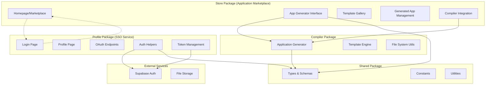

# Design Document

## Overview

This design outlines the refactoring of the existing store package and creation of a new profile package to better separate concerns. The store will become a web-based application marketplace and generator interface, while the profile package will serve as a dedicated SSO authentication service.

## Architecture

### High-Level Architecture



### Package Structure

#### Store Package (Refactored)
- **Purpose**: Web interface for creating and managing applications
- **Core Features**: 
  - Application marketplace interface
  - Visual app generator with form-based configuration
  - Template gallery and examples
  - Integration with compiler for app generation
  - Generated app management and download

#### Profile Package (New)
- **Purpose**: Dedicated SSO authentication service
- **Core Features**:
  - Login/registration pages
  - User profile management
  - OAuth provider integration
  - Token generation and validation
  - Lightweight and focused architecture

## Components and Interfaces

### Store Package Components

#### 1. Marketplace Interface (using UI lib components)
```typescript
// Uses Card, Button, Badge, Hero, Input components from @suppers/ui-lib
interface MarketplaceProps {
  templates: ApplicationTemplate[];
  recentApps: Tables<"applications">[];
  onCreateNew: () => void;
  onSelectTemplate: (template: ApplicationTemplate) => void;
}

interface ApplicationTemplate {
  id: string;
  name: string;
  description: string;
  preview: string;
  category: string;
  features: string[];
  spec: Partial<ApplicationSpec>;
}
```

#### 2. App Generator Interface (using UI lib forms)
```typescript
// Uses Input, Select, Checkbox, Button, Modal, Steps components from @suppers/ui-lib
interface AppGeneratorProps {
  initialSpec?: Partial<ApplicationSpec>;
  onGenerate: (spec: ApplicationSpec) => Promise<GenerationResult>;
  onPreview: (spec: ApplicationSpec) => void;
}

interface GeneratorFormData {
  application: {
    name: string;
    description: string;
    version: string;
  };
  template: TemplateType;
  features: {
    authentication: boolean;
    database: boolean;
    api: boolean;
  };
  routes: RouteConfig[];
  styling: {
    theme: string;
    customCSS?: string;
  };
}
```

#### 3. Compiler Integration Service
```typescript
interface CompilerService {
  generateApplication(spec: ApplicationSpec): Promise<GenerationResult>;
  validateSpec(spec: ApplicationSpec): Promise<ValidationResult>;
  getAvailableTemplates(): Promise<ApplicationTemplate[]>;
  getComponentRegistry(): Promise<ComponentRegistry>;
}
```

### Profile Package Components

#### 1. Authentication Islands (using UI lib components)
```typescript
// Moved from store package - uses LoginPage, UserPage, Card, Button, Input components from @suppers/ui-lib
interface AuthLoginIslandProps {
  initialMode?: "login" | "register";
  redirectTo?: string;
  clientId?: string; // For OAuth flows
  scope?: string;
}

interface AuthProfileIslandProps {
  showBackToApp?: boolean;
  appName?: string;
  appUrl?: string;
}
```

#### 2. OAuth Service (using database types)
```typescript
interface OAuthService {
  generateAuthUrl(params: OAuthParams): string;
  handleCallback(code: string, state: string): Promise<TokenResponse>;
  validateToken(token: string): Promise<Tables<"users">>;
  refreshToken(refreshToken: string): Promise<TokenResponse>;
}

interface OAuthParams {
  clientId: string;
  redirectUri: string;
  scope: string;
  state: string;
  responseType: "code" | "token";
}
```

### Shared Interfaces

#### 1. Application Specification Extensions
```typescript
interface StoreApplicationSpec extends ApplicationSpec {
  metadata: {
    createdAt: string;
    updatedAt: string;
    author?: string;
    tags: string[];
    category: string;
  };
  generation: {
    status: "pending" | "generating" | "completed" | "failed";
    outputPath?: string;
    downloadUrl?: string;
    errors?: string[];
  };
}
```

#### 2. Authentication Types
```typescript
interface AuthConfig {
  providers: OAuthProvider[];
  redirectUrls: string[];
  tokenExpiry: number;
  refreshTokenExpiry: number;
}

interface TokenResponse {
  access_token: string;
  token_type: "Bearer";
  expires_in: number;
  refresh_token?: string;
  scope: string;
  user: UserProfile;
}
```

## Data Models

### Store Package Models (using database types)

#### 1. Generated Application (extends database types)
```typescript
// Uses Tables<"applications"> from database-types.ts
type GeneratedApp = Tables<"applications"> & {
  generation: {
    status: "generating" | "ready" | "failed";
    outputPath?: string;
    downloadUrl?: string;
    previewUrl?: string;
    errors?: string[];
  };
}
```

#### 2. Application Template
```typescript
interface ApplicationTemplate {
  id: string;
  name: string;
  description: string;
  category: "business" | "portfolio" | "blog" | "ecommerce" | "dashboard";
  preview: {
    image: string;
    demoUrl?: string;
  };
  spec: Partial<ApplicationSpec>;
  features: string[];
  complexity: "beginner" | "intermediate" | "advanced";
  estimatedTime: string;
}
```

### Profile Package Models (using database types)

#### 1. OAuth Client (uses database types)
```typescript
// Uses Tables<"oauth_clients"> from database-types.ts
type OAuthClient = Tables<"oauth_clients">;
```

#### 2. OAuth Token (uses database types)
```typescript
// Uses Tables<"oauth_tokens"> from database-types.ts
type OAuthToken = Tables<"oauth_tokens">;
```

#### 3. User Profile (uses database types)
```typescript
// Uses Tables<"users"> from database-types.ts
type UserProfile = Tables<"users">;
```

## Error Handling

### Store Package Error Handling

#### 1. Generation Errors
```typescript
interface GenerationError {
  type: "validation" | "compilation" | "filesystem" | "network";
  message: string;
  details?: Record<string, any>;
  suggestions?: string[];
}

class GenerationErrorHandler {
  static handleValidationError(error: ValidationError): GenerationError;
  static handleCompilationError(error: CompilerError): GenerationError;
  static handleFilesystemError(error: FileSystemError): GenerationError;
}
```

#### 2. User-Friendly Error Display
- Form validation errors with inline feedback
- Generation progress with error recovery options
- Detailed error logs for debugging
- Suggested fixes for common issues

### Profile Package Error Handling

#### 1. Authentication Errors
```typescript
interface AuthError {
  type: "invalid_credentials" | "oauth_error" | "token_expired" | "access_denied";
  message: string;
  redirectTo?: string;
}

class AuthErrorHandler {
  static handleOAuthError(error: OAuthError): AuthError;
  static handleTokenError(error: TokenError): AuthError;
  static handleAccessError(error: AccessError): AuthError;
}
```

## Testing Strategy

### Store Package Testing

#### 1. Unit Tests
- Compiler integration service tests
- Form validation logic tests
- Template processing tests
- File generation tests

#### 2. Integration Tests
- End-to-end app generation flow
- Template gallery functionality
- Download and deployment processes
- Error handling scenarios

#### 3. UI Tests
- Form interaction and validation
- Generation progress display
- Template selection and preview
- Responsive design testing

### Profile Package Testing

#### 1. Unit Tests
- Authentication helper functions
- OAuth flow logic
- Token validation and refresh
- User profile management

#### 2. Integration Tests
- Complete authentication flows
- OAuth provider integration
- Session management
- Cross-origin request handling

#### 3. Security Tests
- Token security and validation
- OAuth state parameter validation
- CSRF protection
- Rate limiting

### Shared Testing

#### 1. Type Safety Tests
- Schema validation tests
- Interface compatibility tests
- Migration compatibility tests

#### 2. Performance Tests
- Application generation performance
- Authentication response times
- Database query optimization
- Memory usage monitoring

## Migration Strategy

### Phase 1: Create Profile Package Structure
1. Create new `packages/profile` directory
2. Set up Fresh application structure
3. Configure Deno configuration and dependencies
4. Set up basic routing structure

### Phase 2: Move Authentication Code
1. Copy authentication islands from store to app
2. Copy authentication routes and handlers
3. Copy auth helpers and Supabase client
4. Update imports and dependencies

### Phase 3: Refactor Store Package
1. Remove authentication-related code from store
2. Create marketplace interface components
3. Implement app generator forms
4. Add compiler integration service

### Phase 4: Update Configuration
1. Update environment configurations for both packages
2. Configure separate ports and domains
3. Update shared package dependencies
4. Configure cross-package communication

### Phase 5: Testing and Validation
1. Test authentication flows in profile package
2. Test app generation in store package
3. Validate cross-package integration
4. Performance and security testing

### Phase 6: Documentation and Deployment
1. Update README files for both packages
2. Create deployment configurations
3. Update development scripts
4. Create migration guide for existing users