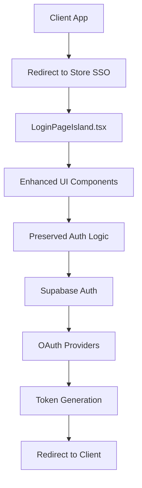

# Design Document

## Overview

This design document outlines the architecture and implementation approach for refactoring the `packages/store` SSO Provider service. The refactoring focuses on integrating `@suppers/ui-lib` components while preserving the critical SSO provider functionality. The design emphasizes component consistency, theme standardization, and code cleanup without disrupting existing authentication flows.

## Architecture

### Current Architecture
- **Framework**: Fresh 2.0 (alpha) with Preact
- **Styling**: TailwindCSS + daisyUI with 30+ themes
- **Authentication**: Supabase Auth with OAuth providers
- **UI Library**: Partial integration with `@suppers/ui-lib`
- **SSO Role**: Centralized authentication provider for client applications

### Target Architecture
- **Component Layer**: Enhanced with ui-lib base components (Input, Button, Card, Alert, Loading, Toast)
- **Authentication Layer**: Preserved existing SSO provider logic and OAuth integrations
- **Styling Layer**: Standardized daisyUI theme tokens replacing hardcoded colors
- **Dependency Layer**: Cleaned up duplicate packages and unused dependencies

## Components and Interfaces

### Core Component Enhancement

#### LoginPageIsland.tsx Enhancement
**Current State**: 420+ lines of custom JSX with hardcoded styling
**Target State**: Preserved SSO logic with ui-lib component integration

```tsx
// Enhanced component structure
interface EnhancedLoginPageIsland {
  // Preserved SSO functionality
  ssoProviderLogic: SSO_PROVIDER_LOGIC;
  oauthIntegrations: OAUTH_PROVIDERS[];
  redirectHandling: SSO_REDIRECT_LOGIC;
  
  // Enhanced UI components
  uiComponents: {
    Input: UILibInput;
    Button: UILibButton;
    Card: UILibCard;
    Alert: UILibAlert;
    Loading: UILibLoading;
    Toast: UILibToast;
  };
}
```

#### Component Integration Strategy
1. **Input Components**: Replace custom input elements with ui-lib `Input`, `EmailInput`, `PasswordInput`
2. **Action Components**: Replace custom buttons with ui-lib `Button` with appropriate variants
3. **Layout Components**: Wrap forms in ui-lib `Card` components for consistency
4. **Feedback Components**: Use ui-lib `Alert` for errors, `Loading` for states, `Toast` for notifications

### Authentication Flow Preservation

#### SSO Provider Flow


#### Component Interaction Design
```tsx
interface AuthenticationComponents {
  loginForm: {
    component: "Enhanced LoginPageIsland";
    uiComponents: ["Input", "Button", "Card"];
    preservedLogic: ["OAuth", "JWT", "Redirects"];
  };
  
  profileManagement: {
    component: "ProfilePageIsland";
    uiComponents: ["UserPage"]; // Already using ui-lib
    status: "No changes needed";
  };
  
  authHelpers: {
    component: "AuthHelpers class";
    integration: "Maintain compatibility with ui-lib patterns";
    preservedFunctionality: ["signUp", "signIn", "OAuth"];
  };
}
```

## Data Models

### Component State Management
```tsx
interface ComponentState {
  // Preserved authentication state
  authState: {
    user: User | null;
    loading: boolean;
    error: string | null;
    success: string | null;
  };
  
  // Enhanced UI state
  uiState: {
    formMode: "login" | "register" | "forgotPassword";
    validationErrors: Record<string, string>;
    componentStates: {
      inputs: InputState[];
      buttons: ButtonState[];
      alerts: AlertState[];
    };
  };
}
```

### Theme Configuration
```tsx
interface ThemeConfiguration {
  daisyUIThemes: string[]; // 29 supported themes
  tokenMapping: {
    // Replace hardcoded colors with theme tokens
    "bg-blue-600": "bg-primary";
    "text-gray-900": "text-base-content";
    "border-gray-300": "border-base-300";
  };
  
  componentTheming: {
    inputs: "input-bordered";
    buttons: "btn-primary";
    cards: "card-bordered";
    alerts: "alert-error | alert-success | alert-info";
  };
}
```

## Error Handling

### Enhanced Error Management
```tsx
interface ErrorHandlingStrategy {
  // UI-lib component integration
  errorDisplay: {
    component: "Alert";
    variants: ["error", "warning", "info"];
    positioning: "form-level" | "field-level";
  };
  
  // Preserved authentication errors
  authErrors: {
    supabaseErrors: "Maintain existing error handling";
    oauthErrors: "Preserve OAuth provider error flows";
    validationErrors: "Enhanced with ui-lib validation patterns";
  };
  
  // User feedback enhancement
  userFeedback: {
    loading: "Loading component with spinner";
    success: "Toast notifications for success states";
    errors: "Alert components for error states";
  };
}
```

### Error Recovery Patterns
1. **Form Validation**: Use ui-lib input validation states
2. **Network Errors**: Display using ui-lib Alert components
3. **Authentication Failures**: Preserve existing error handling with enhanced UI
4. **OAuth Errors**: Maintain existing OAuth error flows

## Testing Strategy

### Component Integration Testing
```tsx
interface TestingApproach {
  unitTests: {
    components: "Test ui-lib component integration";
    authentication: "Preserve existing auth flow tests";
    theming: "Test theme token application";
  };
  
  integrationTests: {
    ssoFlows: "Test complete SSO provider flows";
    oauthProviders: "Test all OAuth integrations";
    clientRedirects: "Test redirect flows to client apps";
  };
  
  visualTests: {
    themeConsistency: "Test all 29 daisyUI themes";
    responsiveDesign: "Test mobile/desktop layouts";
    accessibility: "Leverage ui-lib accessibility features";
  };
}
```

### Performance Testing
1. **Bundle Size**: Monitor impact of ui-lib component integration
2. **Loading Times**: Ensure no performance regressions
3. **Memory Usage**: Test for memory leaks with new components
4. **Theme Switching**: Test performance of theme transitions

## Implementation Phases

### Phase 1: Component Enhancement (Week 1-2)
```tsx
interface Phase1Implementation {
  loginPageEnhancement: {
    replaceInputs: "Custom inputs → ui-lib Input components";
    replaceButtons: "Custom buttons → ui-lib Button components";
    addCards: "Wrap forms in ui-lib Card components";
    preserveLogic: "Maintain all SSO provider functionality";
  };
  
  feedbackComponents: {
    loadingStates: "Integrate ui-lib Loading component";
    errorAlerts: "Replace custom error display with Alert";
    successToasts: "Add Toast notifications for success";
  };
}
```

### Phase 2: Style Standardization (Week 2-3)
```tsx
interface Phase2Implementation {
  themeTokens: {
    removeHardcoded: "Replace bg-blue-600, text-gray-900, etc.";
    applyTokens: "Use bg-primary, text-base-content, etc.";
    testThemes: "Verify all 29 daisyUI themes work";
  };
  
  componentStyling: {
    inputStyling: "Apply input-bordered classes";
    buttonStyling: "Apply btn-primary variants";
    cardStyling: "Apply card-bordered classes";
  };
}
```

### Phase 3: Code Cleanup (Week 3-4)
```tsx
interface Phase3Implementation {
  dependencyCleanup: {
    removeDuplicates: "Clean packages/store/packages/ directory";
    verifyImports: "Ensure no broken imports";
    updateTypes: "Remove conflicting type definitions";
  };
  
  codeOptimization: {
    authHelpers: "Align with ui-lib patterns";
    typeDefinitions: "Remove duplicate types";
    unusedCode: "Remove unused components and utilities";
  };
}
```

### Phase 4: Testing and Validation (Week 4)
```tsx
interface Phase4Implementation {
  functionalTesting: {
    ssoFlows: "Test all authentication flows";
    oauthProviders: "Test all OAuth integrations";
    clientIntegration: "Test client app redirects";
  };
  
  visualValidation: {
    themeConsistency: "Screenshot testing across themes";
    responsiveDesign: "Mobile and desktop testing";
    accessibility: "WCAG compliance testing";
  };
  
  performanceValidation: {
    bundleSize: "Measure bundle size impact";
    loadingTimes: "Performance regression testing";
    memoryUsage: "Memory leak detection";
  };
}
```

## Security Considerations

### Authentication Security
- **Preserved Patterns**: Maintain all existing security validations
- **Token Handling**: Keep secure JWT token exchange mechanisms
- **OAuth Security**: Preserve OAuth provider security implementations
- **Session Management**: Maintain existing session security patterns

### UI Security
- **Input Validation**: Leverage ui-lib's built-in validation security
- **XSS Prevention**: Benefit from ui-lib's XSS protection patterns
- **CSRF Protection**: Maintain existing CSRF protection mechanisms

## Performance Optimizations

### Bundle Optimization
- **Tree Shaking**: Import only required ui-lib components
- **Code Splitting**: Maintain existing code splitting patterns
- **Lazy Loading**: Preserve existing lazy loading implementations

### Runtime Performance
- **Component Reuse**: Leverage ui-lib's optimized component implementations
- **Theme Switching**: Optimize theme transition performance
- **Memory Management**: Monitor memory usage with new components

## Migration Strategy

### Backward Compatibility
- **API Compatibility**: Maintain all existing authentication APIs
- **Client Integration**: Ensure no breaking changes for client applications
- **Configuration**: Preserve existing configuration patterns

### Rollback Plan
- **Component Rollback**: Ability to revert to custom components if needed
- **Styling Rollback**: Ability to revert to hardcoded styles if themes fail
- **Dependency Rollback**: Ability to restore duplicate dependencies if imports break