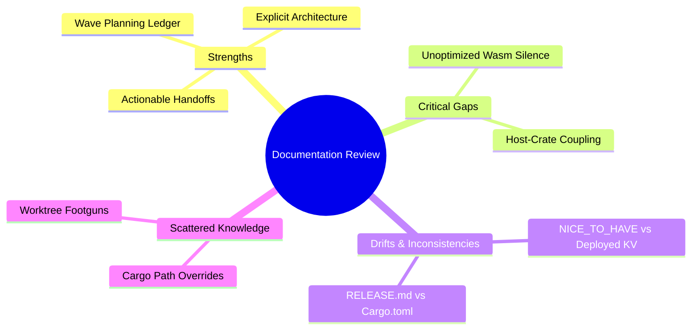

# Solobase Workspace: High-Effect Documentation Review Report

## Executive Summary

An in-depth review of the `solobase` documentation suite was performed. The documentation ecosystem includes root guides (`CLAUDE.md`, `NICE_TO_HAVE.md`, `RELEASE.md`), structural specs under `docs/superpowers/specs/`, chronological implementation plans under `docs/superpowers/plans/`, and a detailed wave-by-wave ledger under `docs/superpowers/handoffs/` (spanning Waves 1 to 18).

While the documentation displays **exceptional discipline** in wave planning and self-contained handoffs, several **critical gaps, version drifts, and stale backlog entries** were identified. Addressing these will dramatically increase team alignment and prevent developer footguns in future sessions.

---

## 1. Major Architectural Gaps & Omissions

### 🔴 The 15.0 MB Wasm Size Silence
- **The Issue:** The browser platform specification ([2026-04-19-solobase-browser-framework-design.md](file:///home/joris/Programs/suppers-ai/workspace/solobase/docs/superpowers/specs/2026-04-19-solobase-browser-framework-design.md)) and the corresponding plan specify the creation of the browser Service Worker. However, **nowhere in these specifications is the final binary size addressed or optimized.**
- **The Gap:** The spec dictates setting `wasm-opt = false` without detailing the massive **15.0 MB** size penalty this incurs. 
- **Impact:** Any new developer implementing the spec would blindly deploy a slow, bloated Service Worker, unaware that enabling `wasm-opt` (and making `reqwest` optional) could instantly shrink it by **80%**.
- **Fix:** Reference our new [wasm_optimization_suggestions.md](file:///home/joris/Programs/suppers-ai/workspace/solobase/docs/wasm_optimization_suggestions.md) plan as a mandatory amendment at the end of the `solobase-browser` design document.

### 🟡 Dead Code & Host-only Bloat in Browser Spec
- **The Issue:** The design spec places `tools/bundle/` and the `export-assets` binary directly inside `crates/solobase-browser/` (marked as a `cdylib` Wasm-targeting crate).
- **The Gap:** The documentation fails to note that mixing native CLI frameworks (like `clap` and `anyhow`) in a Wasm target crate increases compile times and risks bringing in stack-trace bloat if tree-shaking fails.
- **Fix:** Update the specification's "New crate: crates/solobase-browser/" architecture section to explicitly separate host-only utilities into a sibling target crate (e.g. `solobase-bundler`).

---

## 2. Document Drifts & Inconsistencies (Outdated Records)

### 🔴 `NICE_TO_HAVE.md` vs. Completed Deployed Work
- **The Issue:** Under [NICE_TO_HAVE.md:L5-7](file:///home/joris/Programs/suppers-ai/workspace/solobase/NICE_TO_HAVE.md#L5-7), the **Performance** section lists the following open backlog item:
  > **KV caching for project resolution in dispatch worker** — Currently every request queries D1 to resolve the project subdomain. A Cloudflare KV cache with a short TTL (e.g. 60s) would reduce latency and D1 load...
- **The Drift:** In the handoff logs, [2026-05-22-kv-cached-d1-deployed-handoff.md](file:///home/joris/Programs/suppers-ai/workspace/docs/superpowers/handoffs/2026-05-22-kv-cached-d1-deployed-handoff.md) records that this exact **KV-cached D1 config source has already been successfully designed, implemented, and fully deployed!**
- **Impact:** Backlogs claiming completed tasks are open cause wasted developer resources, double-work, and general confusion.
- **Fix:** Mark this task as **[Completed]** or remove it entirely from `NICE_TO_HAVE.md`, replacing it with a note pointing to the deployed KV-cache implementation.

### 🟡 `RELEASE.md` Version vs. `Cargo.toml`
- **The Issue:** The release process guide ([RELEASE.md:L34-37](file:///home/joris/Programs/suppers-ai/workspace/solobase/RELEASE.md#L34-37)) guides developers to tag releases starting with `v0.2.0` and references hotfixing `v0.2.1`.
- **The Drift:** In the root [Cargo.toml:L25-26](file:///home/joris/Programs/suppers-ai/workspace/solobase/Cargo.toml#L25-26), the workspace package version is currently hard-set to `0.1.0`.
- **Impact:** Misaligned versioning scripts and guides lead to incorrect git tagging, failing CI release pipelines, and broken package registries.
- **Fix:** Update the example tag commands in `RELEASE.md` to reflect the correct `v0.1.0` sequence, or add a pre-release step instructing the developer to match the `Cargo.toml` version first.

---

## 3. Scattered Knowledge & Tooling Footguns

The wave-based handoffs contain crucial developer warnings and environment workarounds that are currently **hidden** in transient markdown logs. If a fresh developer spins up a session, they will miss these because they reside in closed waves rather than canonical guides.

### 1. The Git Worktree Upstream Footgun
- **The Knowledge:** [2026-05-28-wave-18-post-merge-handoff.md](file:///home/joris/Programs/suppers-ai/workspace/docs/superpowers/handoffs/2026-05-28-wave-18-post-merge-handoff.md) warns:
  > **Branch upstream footgun:** `git worktree add -b NEW <path> origin/main` silently sets `NEW`'s upstream to `origin/main`. Run `git branch --unset-upstream` post-create.
- **The Gap:** This is a vital workflow step for parallel subagents, but it is not documented in the master setup guides.
- **Fix:** Add this warning directly to the workspace [CLAUDE.md](file:///home/joris/Programs/suppers-ai/workspace/solobase/CLAUDE.md) or a `CONTRIBUTING.md` workspace standard guide.

### 2. The `.cargo/config.toml` Overrides Hiding Lockfile Divergence
- **The Knowledge:** When developing across repositories (`wafer-run` and `solobase` simultaneously), developers patch `.cargo/config.toml`. However, this override masks Cargo.lock differences, causing broken builds on merge.
- **The Gap:** The warning exists only in handoff `Wave 18` and `Wave 17`.
- **Fix:** Document this "cargo update -p git-dep is a no-op when path override is active" gotcha in a central developer standard page.

---

## 4. Strengths of the Documentation

Despite the inconsistencies above, the documentation setup is exceptionally mature:
1. **Self-Contained Handoff Ledger:** The structure of having self-contained, chronological `.md` files under `docs/superpowers/handoffs/` is a masterpiece. It allows any fresh LLM or developer to pick up exactly where the last one left off without parsing commit histories or chat histories.
2. **Deterministic Checklists:** The plans under `docs/superpowers/plans/` utilize extremely descriptive, task-by-task checkboxes. They clearly map out files, step descriptions, and exact shell validation commands.
3. **CLAUDE.md Integration:** The root `CLAUDE.md` is a highly effective, high-level developer instruction set. It immediately establishes architectural invariants (e.g., config variable naming, no sync bridges, and raw SQL bans).

---

## Actionable Recommendations & Clean-Up Tasks

| Priority | Action | Destination | Impact |
| :--- | :--- | :--- | :--- |
| 🥇 **1** | Clean Up KV-Cache in NICE_TO_HAVE | `NICE_TO_HAVE.md` | Eliminates stale backlog records |
| 🥈 **2** | Reference Wasm Opts in Browser Spec | `docs/superpowers/specs/...browser-design.md` | Prevents future 15MB Wasm deployments |
| 🥉 **3** | Consolidate Worktree/Cargo Warnings | `CLAUDE.md` | Saves future sessions from git footguns |
| 🛠️ **4** | Align Versioning | `RELEASE.md` | Harmonizes Cargo workspace and release git tags |
