# WebAssembly Optimization Plan: Solobase Wasm Size & Speed Reduction

## Executive Summary

A comprehensive review of the `solobase` workspace shows that the compiled browser WebAssembly binary (`solobase_web_bg.wasm`) currently stands at **15,012,784 bytes (~15.0 MB)**. This size is extremely large for a browser Service Worker and negatively impacts page-load speed, network consumption, and initial boot time.

By implementing the optimizations proposed below, the binary size can be realistically reduced to **3.0 MB – 5.0 MB (a 65% to 80% reduction)** while simultaneously improving execution speed.

```mermaid
gantt
    title Estimated Optimization Impact on Wasm Size (MB)
    dateFormat  X
    axisFormat %s
    
    section Binary Size
    Current Binary Size (No Opts)    :active, 0, 15
    Phase 1: wasm-opt Enabled (-Oz) :crit, 0, 6
    Phase 2: reqwest Gated & Stripped :active, 0, 4.5
    Phase 3: panic = "abort" Added   :0, 3.8
    Phase 4: Crate Architectural Split :0, 3.5
```



---

## 1. Enable `wasm-opt` (The #1 Optimization)

### The Problem
In `crates/solobase-web/Cargo.toml` and `crates/solobase-browser/Cargo.toml`, `wasm-opt = false` is explicitly set under the `wasm-pack` release profile:
```toml
[package.metadata.wasm-pack.profile.release]
wasm-opt = false
```
This forces `wasm-pack` to completely skip the post-processing optimization pass. The raw output from the Rust compiler is full of unoptimized blocks, redundant instructions, and dead paths.

### Why was it disabled?
`wasm-pack` tries to download a precompiled `wasm-opt` binary automatically. This often fails in offline development environments, firewalled CI/CD runners, or ARM64 architectures (e.g. Apple Silicon). To bypass this failure, developers often disable it globally.

### The Solution
Instead of disabling it, you can install the optimization tools locally and run them explicitly as part of the build pipeline in your `justfile`. 

#### Step 1: Enable native `binaryen` installation
Ensure `binaryen` (which contains `wasm-opt`) is installed on the build machine:
- **Ubuntu/Debian:** `sudo apt-get install binaryen`
- **macOS:** `brew install binaryen`

#### Step 2: Update the `justfile`
Edit your `justfile` to run `wasm-opt` directly after `wasm-pack` finishes compiling:

```diff
 # Build solobase-web wasm via wasm-pack (gets wasm-opt automatically),
 # then the solobase CLI binary which include_bytes!s the wasm.
 build:
     cd crates/solobase-web && RUSTFLAGS="-C target-feature=+simd128" wasm-pack build --target web --release --out-dir pkg
+    wasm-opt -Oz crates/solobase-web/pkg/solobase_web_bg.wasm -o crates/solobase-web/pkg/solobase_web_bg.wasm
     cargo build -p solobase --release
 
 # Build the CLI in debug profile. Wasm stays release-built (no point
 # shipping a debug wasm — it's data baked into the binary).
 build-debug:
     cd crates/solobase-web && RUSTFLAGS="-C target-feature=+simd128" wasm-pack build --target web --release --out-dir pkg
+    wasm-opt -O3 crates/solobase-web/pkg/solobase_web_bg.wasm -o crates/solobase-web/pkg/solobase_web_bg.wasm
     cargo build -p solobase
```
> [!NOTE]
> `-Oz` optimizes strictly for binary size, while `-O3` optimizes for speed with strong size considerations. For a browser Service Worker, `-Oz` is highly recommended.

---

## 2. Gate and Strip the `reqwest` Dependency

### The Problem
In `crates/solobase-core/Cargo.toml`, `reqwest` is pulled in as a mandatory, unconditional dependency:
```toml
reqwest = { workspace = true }
```
The comments state `reqwest` is always on for OAuth provider implementations. However, a grep search shows that **no OAuth or authorization modules in `solobase-core` actually use `reqwest`**. All OAuth logic relies on `wafer`'s standard HTTP routing and pipeline abstractions.

The **only** file in `solobase-core` that imports `reqwest` is `src/blocks/llm/providers/mod.rs` (the LLM providers streaming transport). This module is gated behind the `llm` feature:
```rust
#[cfg(feature = "llm")]
pub mod providers;
```
Because the `reqwest` dependency is declared unconditionally in `Cargo.toml`, the Rust compiler compiles and links the entire `reqwest` crate (and all its transitives like `h2`, `http-body`, `percent-encoding`, `tower`, etc.) into `solobase-web`'s Wasm binary, even though the `llm` feature is turned off in `solobase-web`!

### The Solution
Make `reqwest` an optional dependency in `crates/solobase-core/Cargo.toml` and gate it under the `llm` feature.

#### Step 1: Modify `crates/solobase-core/Cargo.toml`
Update the `reqwest` dependency to be `optional = true`, and append `dep:reqwest` to the `llm` feature array:

```diff
 [features]
 default = [
     "sqlite",
     ...
 ]
 
 llm = [
     "dep:tokio",
     "dep:tokio-stream",
+    "dep:reqwest",
     "reqwest/stream",
     "block-llm",
 ]
 
 [dependencies]
 ...
-reqwest = { workspace = true }
+reqwest = { workspace = true, optional = true }
```

This ensures that if a crate compiles `solobase-core` with `default-features = false` and omits `"llm"` (which `solobase-web` explicitly does!), `reqwest` is completely omitted from the compile graph. This alone will strip out **several megabytes** of compiled HTTP client machinery.

---

## 3. Enable `panic = "abort"` in Release Profile

### The Problem
Currently, the workspace root `Cargo.toml` specifies optimizations like LTO and single codegen units, but omits the panic strategy:
```toml
[profile.release]
opt-level = "z"
lto = true
codegen-units = 1
strip = true
```

### The Solution
By default, Rust compiles Wasm with stack-unwinding support. This includes substantial landing pad machinery, symbol routing, and formatting strings for panic backtraces. However, WebAssembly does not natively support unwinding; any panic simply traps. 

Adding `panic = "abort"` instructs the compiler to immediately abort upon a panic, letting it completely eliminate unwinding tables, stack-trace formatters, and panic string bloat.

Add `panic = "abort"` to your root `Cargo.toml`:

```diff
 [profile.release]
 opt-level = "z"
 lto = true
 codegen-units = 1
 strip = true
+panic = "abort"
```
> [!TIP]
> This single line usually provides an immediate **10% to 15% reduction** in Rust-generated Wasm binaries without requiring any code changes.

---

## 4. Architectural Split: Separate Host-Only Tools from Wasm Crate

### The Problem
`crates/solobase-browser` contains both the browser runtime Service Worker code (targeting Wasm) and `tools/bundle` (host-only native Rust code for packaging assets).
Because they reside in the same crate, the browser-targeting crate's manifest must declare heavy native-only dependencies:
- `anyhow = "1"`
- `clap = { version = "4", features = ["derive"] }`

Even though the compiler tries to tree-shake native-only modules when building `cdylib` Wasm files, having host-side CLI frameworks like `clap` in the same dependency tree:
1. **Risks bloat:** If any common module imports a tool helper, the tree-shaker cannot eliminate the dependencies, adding major overhead to the Wasm module.
2. **Build Time:** Increases compilation time for the Wasm target since the compiler must compute and check these native dependency graphs.

### The Solution
Move `tools/bundle` and the `export-assets` binary into a separate crate, e.g. `crates/solobase-bundler` or `crates/solobase-cli-tools`.
Keep `crates/solobase-browser` strictly focused on Wasm target code (containing only `database.rs`, `storage.rs`, `network.rs`, `crypto.rs`, etc.) with zero dependencies on `clap` or `anyhow`.

---

## 5. Leverage Browser Native Web Crypto API for JWTs

### The Problem
In `crates/solobase-browser/src/crypto.rs`, the signing and verification of JWTs are delegated to `wafer_block_crypto::service::Argon2JwtCryptoService`:
```rust
    fn sign(&self, claims: HashMap<String, serde_json::Value>, expiry: Duration) -> Result<String, CryptoError> {
        wafer_block_crypto::service::Argon2JwtCryptoService::new(self.jwt_secret())?
            .sign(claims, expiry)
    }
```
`wafer_block_crypto` uses pure Rust cryptography crates to sign and verify HMAC-SHA256 tokens. Compiling these crypto routines into Wasm adds unnecessary bytes.

### The Solution
Since the Service Worker runs inside a modern browser environment, it has access to the highly optimized, native, multi-threaded **Web Crypto API** (`crypto.subtle`). 

By calling the native `crypto.subtle.sign` and `crypto.subtle.verify` via `web-sys`, you can:
1. **Speed up token validation:** Native implementations run in C++ at the browser level and are vastly faster than single-threaded Wasm-interpreted cryptography.
2. **Reduce Wasm size:** Completely drops the compiled pure-Rust HMAC and signing dependencies from the Wasm module.

---

## Summary of Actionable Steps

| Priority | Optimization | Location | Type | Est. Size Saved |
| :--- | :--- | :--- | :--- | :--- |
| 🥇 **1** | Enable `wasm-opt -Oz` | `justfile` / `Cargo.toml` | Build Config | **6.0 MB – 8.0 MB** |
| 🥈 **2** | Make `reqwest` optional | `crates/solobase-core/Cargo.toml` | Dependency Refactor | **2.0 MB – 3.0 MB** |
| 🥉 **3** | Add `panic = "abort"` | Root `Cargo.toml` | Profile Config | **0.5 MB – 1.0 MB** |
| 🛠️ **4** | Separate host-only crates | `crates/solobase-browser` | Architecture | **0.2 MB – 0.5 MB** |
| ⚡ **5** | Move JWTs to Web Crypto API | `solobase-browser/src/crypto.rs` | Code Refactor | **0.2 MB** |
